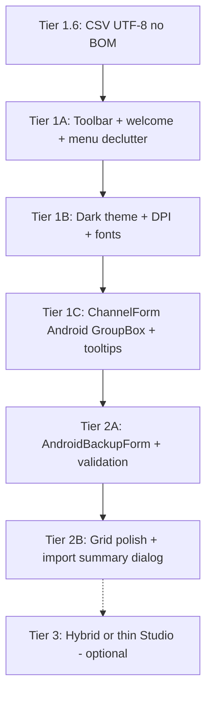

# OpenGD77 CPS (PriInterPhone Fork) — UI Modernization Plan

**Document:** UI improvement roadmap  
**Applies to:** [OpenGD77CPS-Mac](https://github.com/IIMacGyverII/OpenGD77CPS-Mac) (fork source)  
**Related:** [phonedmrapp](https://github.com/IIMacGyverII/phonedmrapp) / `DMRModHooks` Android module  
**Last updated:** June 5, 2026  
**Status:** In progress — v1.3.4: Tier 2.10b ADB push export to phone; v1.3.3: Tier 2.6 contact integrity checker + DPI manifest; v1.3.2: Tier 2.10 ADB pull for phone backups; v1.3.1: MTP copy-to-PC folder picker; v1.3.0: Tier 2.5 pre-import channel diff (Apply/Cancel); v1.2.7: File menu layout fix; v1.2.6: label fix all editors, channel filter, grid stripes, import preview counts; v1.2.4–5 validation/Ctrl+Z; v1.2.1–3 Tier 1 shell

---

## Purpose

This document captures recommended UI/UX improvements for the **PriInterPhone / DMRModHooks** OpenGD77 CPS fork. The goal is to make the desktop tool feel intentional for the **Android CSV workflow**, visually consistent with the phone mod where practical, and easier to use without breaking CSV round-trip logic or binary codeplug compatibility.

**Out of scope here:** Changes to Pitfall 12, relay mapping, Path B import indices, or `ChannelOne` struct layout — see [CODEBASE_DEEP_DIVE.md](CODEBASE_DEEP_DIVE.md) and `phonedmrapp/.github/copilot-instructions.md`.

---

## Current UI stack (baseline)

| Item | Detail |
|------|--------|
| Framework | .NET Framework **4.8**, **x86** WinExe |
| UI | **Windows Forms** + [Dock Panel Suite](https://github.com/dockpanelsuite/dockpanelsuite) (`WeifenLuo.WinFormsUI.Docking`) |
| Entry shell | `DMR/MainForm.cs` — menu, toolbar, tree, `DockPanel`, status strip |
| Editors | `ChannelForm`, `ChannelsForm`, `ContactsForm`, … inherit `DockContent` |
| Layout style | Large inline `InitializeComponent()` blocks (decompiler-style); **no** separate `*.Designer.cs` per form in `DMR/` |
| Localization | `Settings.smethod_68/69` + XML resource files — **renaming controls breaks translations** |
| Fork branding | `DMR/AboutForm.cs` — `FORK_VERSION`, `FORK_NAME`, red warning block |
| PriInterPhone CSV | Menu **File → Import CSV Files…** / **Export CSV Files…** → `ChannelsForm.ImportFromCsvFile()` (**Path B only**) |

### Scale (why “rewrite everything” is expensive)

- `MainForm.cs` — ~4,500 lines  
- `ChannelForm.cs` — ~5,100 lines, ~90+ control types, hundreds of pixel `Location`/`Size` assignments  
- Many additional docked forms (zones, contacts, scan, VFO, firmware, USB programming)

A full port to WPF, Avalonia, MAUI, or Electron is possible but is a **multi-month** program because USB, firmware loader, and the entire form tree move with it. This plan prioritizes **incremental WinForms** improvements.

---

## Design principles

1. **Workflow first** — Users export from the phone, edit on PC, re-import. UI should lead with that path, not stock GD-77 USB programming.  
2. **Do not break Path B** — Grid/channel Import buttons use Path A (35-col header only). Promote menu batch import.  
3. **Do not break binary `.g77`** — Lat/lon, encrypt key, use-location stay in **static CSV arrays** on `ChannelForm`, not in `ChannelOne` (v1.1 crash lesson).  
4. **Preserve control names** unless XML language files are updated in the same change.  
5. **Fork identity** — Visual and copy must reinforce: **not for stock Radioddity GD-77**.  
6. **Optional visual parity** — Align with DMRModHooks navy theme on Android (`#0A1520`, `#060D14`) where cheap on WinForms.

---

## Tier 1 — Low risk, high impact (estimate: days to ~2 weeks)

### 1.1 PriInterPhone-first shell

| Improvement | Description | Primary files |
|-------------|-------------|---------------|
| **Android backup toolbar** | Dedicated buttons: *Import Android backup…*, *Export Android backup…*, *Open backup folder*, *Help* (link to fork README / release notes). | `MainForm.cs` |
| **First-run / welcome dialog** | On first launch (or until dismissed): explain 5-file backup folder, Path B only, link to [fork release notes](https://github.com/IIMacGyverII/OpenGD77CPS-Mac/releases) / `docs/RELEASE_NOTES_v1.2.0.md`. | New `AndroidWorkflowForm.cs` |
| **Menu declutter** | Move USB Read/Write, firmware loader, calibration, stock OpenGD77 extras under **Advanced → Stock OpenGD77 / USB** (collapsed by default). | `MainForm.cs` |
| **Status bar hint** | Persistent text: `PriInterPhone CSV fork v{FORK_VERSION} — use File → Import CSV for Android backups`. | `MainForm.cs` |

**Acceptance criteria**

- New user can import a phone export folder without hunting nested menus.  
- No change to `ImportFromCsvFile` / `ExportToAndroidCsvFile` signatures or column indices.

---

### 1.2 Visual theme (DMRModHooks-aligned)

| Improvement | Description | Primary files |
|-------------|-------------|---------------|
| **Dark DockPanel skin** | Tune existing `DockPanelSkin` / tab gradients in `InitializeComponent` (already instantiated in `MainForm`). | `MainForm.cs` |
| **Global colors** | Form background, menu/toolbar/status: dark navy palette. | `MainForm.cs`, optional `Theme.cs` helper |
| **Typography** | Default font **Segoe UI** 9–10pt (or Segoe UI Variable on Windows 11). | `Program.cs` or `Settings` load hook |
| **Application icon** | Consistent fork icon (match releases / GitHub). | `DMR_32512.ico`, `AboutForm` |
| **Third-party theming (optional)** | Evaluate **Krypton Toolkit**, **MaterialSkin**, or **ReaLTaiKri GUI** for WinForms — apply to new dialogs first. | New forms only initially |

**Suggested palette (match phone mod)**

| Role | Color |
|------|--------|
| Background | `#0A1520` |
| Title / chrome | `#060D14` |
| Accent | `#1E3A5F` or existing OpenGD77 accent |
| Warning (fork banner) | Amber/red text on dark panel |

**Acceptance criteria**

- Readable at 100% and 125% Windows scaling.  
- Dock tabs and channel windows visually consistent with main shell.

---

### 1.3 High DPI and scaling

| Improvement | Description |
|-------------|-------------|
| **App manifest** | `app.manifest` with Per-Monitor V2 DPI awareness. |
| **Audit scaling** | Review `Settings.smethod_6()` and `Form.Scale` usage on `AboutForm` and main editors. |
| **New UI only** | New controls use `AutoScaleMode = Dpi`; avoid new hard-coded 640×480 layouts. |

**Acceptance criteria**

- No clipped labels on Channel form Android section at 125–150% display scale.

**Shipped (partial):** v1.3.3 — `app.manifest` Per-Monitor V2 DPI awareness.

---

### 1.4 About and branding (extend v1.2.0)

Already in `AboutForm.cs`: `FORK_VERSION`, `FORK_NAME`, warning text.

| Addition | Description |
|----------|-------------|
| Optional splash | Short splash on startup with fork name + warning. |
| Window title | Include `FORK_VERSION` in `MainForm.Text` (may already be partial). |
| Links | GitHub: OpenGD77CPS-Mac + phonedmrapp releases. |

---

### 1.5 Channel editor — Android field grouping

Addresses v1.1 **layout overlap** class of issues without moving data off static arrays.

| Improvement | Description | Primary files |
|-------------|-------------|---------------|
| **GroupBox or TabPage** | Section **“PriInterPhone / Android (CSV only)”**: Latitude, Longitude, Use Location, Encrypt Key, APRS-related fields, Contact Type, Channel Mode, Relay, etc. | `ChannelForm.cs` |
| **Collapsible advanced** | Rarely used OEM fields in **“Advanced (binary codeplug)”** collapsed by default for fork users. | `ChannelForm.cs` |
| **Tooltips** | “Not stored in `.g77` — only preserved via CSV round-trip” on CSV-only fields. | `ChannelForm.cs` |

**Acceptance criteria**

- v1.2.0 lat/lon round-trip tests still pass.  
- No new fields added to `ChannelOne` struct.

---

### 1.6 CSV encoding guard

Every CSV read must strip BOM; every CSV write must use `new UTF8Encoding(false)` explicitly. Currently, a user who touches the CSV with PowerShell `Set-Content` between CPS sessions silently corrupts the file on re-import (Pitfall 16 in `phonedmrapp`). Add a static `CsvEncoding` helper and use it in all `StreamReader`/`StreamWriter` calls across `ChannelsForm`, `ContactsForm`, exporters.

| Where | Change |
|-------|--------|
| All CSV readers | `new StreamReader(path, new UTF8Encoding(false))` with BOM strip on first line |
| All CSV writers | `new StreamWriter(path, false, new UTF8Encoding(false))` |
| Status bar | After export: confirm "Exported as UTF-8 (no BOM)" |

**Acceptance criteria:** A CSV written by CPS and edited with `Set-Content -Encoding UTF8` (BOM added) imports cleanly.

---

### 1.7 Codeplug summary / health panel

A small read-only status area (status strip or side panel) populated at load/import time:

| Stat | Example |
|------|---------|
| Channels | `142 total (88 digital, 54 analog)` |
| Contacts | `37` |
| Zones | `8` |
| TG lists | `5` |
| Orphaned contacts | `2 channels reference unknown DMR IDs` |
| Relay=0 channels | `0` (amber if > 0) |

Zero new forms needed — populates `statusStrip` labels and/or a `ToolStripDropDownButton`. Catches bad imports before the phone does.

---

### 1.8 Contact type badge in channel grid

Add a narrow **Type** column to the channel list grid showing `G` (Group), `P` (Private), or `A` (All-Call) for the assigned contact. Given the swapped Group/Private history, having this visible at a glance in the grid lets the user spot an inversion without opening each channel.

**Primary file:** `ChannelsForm.cs` — read `ContactType` from `ChannelOne` at row-render time.

---

### 1.9 Keyboard shortcuts

Standard shortcuts currently absent:

| Shortcut | Action |
|----------|--------|
| `Ctrl+I` | Android backup import (Path B) |
| `Ctrl+E` | Android backup export |
| `F2` | Open selected channel in editor |
| `Ctrl+D` | Duplicate selected channel(s) |
| `Ctrl+Z` | Revert channel form to last saved (see 2.7) |
| `Del` | Delete selected channel row(s) with confirmation |

**Primary file:** `MainForm.cs` (global shortcuts), `ChannelsForm.cs` (grid shortcuts), `ChannelForm.cs` (`F2` / `Ctrl+Z`).

---

## Tier 2 — Medium effort (estimate: 2–4 weeks)

### 2.1 Channel list grid modernization

| Improvement | Description | Primary files |
|-------------|-------------|---------------|
| **DataGridView polish** | Double-buffering, alternating row colors, clear Analog/Digital column or icon. | `ChannelsForm.cs` |
| **Sorting / filter** | Sort by channel number, name, type; quick filter box. | `ChannelsForm.cs` |
| **Optional library** | [ObjectListView](https://github.com/pjaeger00/ObjectListView) if native grid is insufficient. | Project references |

---

### 2.2 Dedicated “Android backup” window

New form with **clean code** (not refactoring the entire decompiled `ChannelsForm` at once).

| Feature | Description |
|---------|-------------|
| Folder picker | Select `DMR_Backups/YYYYMMDD_HHmmss/` |
| File checklist | Contacts, TG_Lists, Channels, Zones, DTMF — green/red validation |
| Pre-import validation | 37-col `_id` header, relay ≠ 0 warnings, duplicate channel names |
| Actions | **Import all (Path B)**, **Export all (Android format)** |
| Log panel | Rows imported/skipped/errors |

**Primary implementation:** New `AndroidBackupForm.cs` calling existing static methods on `ChannelsForm` / exporters.

**Acceptance criteria**

- Same import order as phone: Contacts → TG_Lists → Channels → Zones → DTMF.  
- Single place documents Path A vs Path B.

---

### 2.3 Docking UX

| Improvement | Description |
|-------------|-------------|
| **Default layout profile** | Tree + channel list + channel detail on first run. |
| **Reset layout** | Button: *Restore PriInterPhone default layout* (ships `DockPanel.config` template). |
| **Persist layout** | Keep existing `DockPanel.config` save; document in help. |

---

### 2.4 Import/export feedback

| Improvement | Description |
|-------------|-------------|
| **Summary dialog** | After batch import: files processed, channel count, warnings (relay 0, stale arrays cleared). |
| **Progress UI** | `WaitForm` or progress bar for large CSV folders — avoid frozen UI. |
| **Error aggregation** | One scrollable log instead of sequential `MessageBox` chains. |

---

### 2.5 Pre-import diff preview

Before committing an import, show a diff table: channels that will be **added**, **modified** (which fields change), and **deleted** compared to the current in-memory codeplug. Prevents silent channel-list wipes from a corrupt or mismatched CSV (Pitfall 16 replay).

| Column | Content |
|--------|---------|
| Status | Added / Changed / Deleted / Unchanged |
| Channel | Name + number |
| Changed fields | e.g. `txContact: 310 → 1` |

**Natural home:** `AndroidBackupForm.cs` (Tier 2.2). Can be a `DataGridView` in a `Form.ShowDialog()` with **Apply** / **Cancel**.

**Acceptance criteria:** User can see exactly what will change and abort without modifying the loaded codeplug.

**Shipped:** v1.3.0 — `AndroidImportDiff.cs`, `AndroidImportDiffForm.cs`; wired from `MainForm.ImportAndroidBackupFolder` and summary in `AndroidBackupForm`.

---

### 2.6 Contact integrity checker

After import (or on-demand), cross-reference `channel_txContact` values in Channels.csv against the contact DMR IDs in Contacts.csv. Flag channels whose contact DMR ID resolves to nothing — these are Pitfall 12 survivors that won't TX correctly on the phone.

| Warning | Example |
|---------|---------|
| Unresolved contact | `Medina-T1-N0AGI: txContact=310 not in Contacts.csv` |
| Relay=0 | `STMA EMS: relay=0 will cause "operation failed" on phone` |
| Channel mode unknown | `channel_mode=5 is not 0 (Direct) or 3/4 (Double slot)` |

Show as a collapsible warning panel in `AndroidBackupForm` before the user closes the session.

**Shipped:** v1.3.3 — `AndroidContactIntegrityChecker.cs`; expandable warnings in `AndroidBackupForm`.

---

### 2.7 Undo / revert on channel form

Store a snapshot of all `DispData()` values when `ChannelForm` opens. **Revert** button (or `Ctrl+Z`) restores to that snapshot without requiring the file to be reloaded. Single-level only — no full undo stack complexity.

**Primary file:** `ChannelForm.cs` — `Dictionary<string, object> _snapshot` saved at `OnLoad`, restored on revert click.

**Acceptance criteria:** Accidental field wipe on an open channel form is recoverable without closing and re-opening the form.

---

### 2.8 Multi-select bulk edit in grid

Select multiple channels in the grid → right-click context menu:

| Action | Fields affected |
|--------|-----------------|
| Set Power… | `Power` |
| Set Bandwidth… | `Bandwidth` |
| Set Squelch… | `Squelch` |
| Assign TG List… | (CSV-only note) |
| Set Channel Mode… | `ChannelMode` (map 3↔4) |

Applies changes via `ChannelOne.SaveData()` per selected row. Useful when migrating a full repeater network where all channels need the same power/bandwidth.

**Primary file:** `ChannelsForm.cs` — context menu on `DataGridView.SelectedRows`.

---

### 2.9 Column visibility toggle

Right-click on the channel grid column header → show/hide individual columns. Persist preference in user settings (`DockPanel.config` or `Settings`). Standard DataGridView capability; reduces visual clutter for users who only care about Name / Frequency / Type.

---

### 2.10 ADB auto-detect for backup folder

If `adb.exe` is on PATH (or configured via Settings → ADB path), auto-list `DMR_Backups/` subfolders from the connected phone and let the user pick by timestamp — no manual file browsing needed. Falls back to standard folder picker if adb is unavailable.

| Step | Detail |
|------|--------|
| Detect | `adb devices` — if one device, proceed |
| List | `adb shell ls /sdcard/Download/DMR_Backups/` |
| Pick | Timestamp list in `AndroidBackupForm` |
| Pull | `adb pull /sdcard/Download/DMR_Backups/{selected}/` to temp folder |
| Import | Hand off to existing `ImportFromCsvFile` (Path B) |

**Acceptance criteria:** Works without adb — folder picker is always the fallback. ADB calls run on a background thread (`Task.Run`) so the UI never freezes.

**Shipped:** v1.3.2 — `AndroidAdbBackup.cs`, `AndroidAdbPickForm.cs`; **Pull from phone (ADB)** in `AndroidBackupForm`; import menu offers ADB when `adb.exe` is available.

**Shipped:** v1.3.4 — `AndroidAdbPushForm.cs`; **Export && push (ADB)**; File → Export offers push when adb is available.

---

## Tier 3 — Strategic / large (estimate: months)

Choose only if Tier 1–2 are insufficient.

### 3.1 WinForms + WebView2 hybrid

- Keep WinForms shell for USB/programming.  
- Host HTML/CSS panel for backup browser, channel summary, validation report.  
- **Pros:** Modern typography and layout without rewriting `ChannelForm`.  
- **Cons:** Two stacks, deployment of WebView2 runtime.

### 3.2 Thin “PriInterPhone Codeplug Studio”

- Minimal app: only 5 CSV types + validation + diff view.  
- Full OpenGD77 CPS remains for power users / USB.  
- **Pros:** Small maintainable UI; matches real user workflow.  
- **Cons:** Two executables to release.

### 3.3 Full UI framework rewrite (WPF / Avalonia / MAUI)

| Framework | Notes |
|-----------|--------|
| **WPF** | Windows-only; good MVVM; full rewrite of all forms. |
| **Avalonia** | Cross-platform CPS on Mac/Linux; USB/x86 on Mac awkward. |
| **MAUI** | Cross-platform; high rewrite cost. |

**Recommendation:** Defer unless there is a dedicated budget and test matrix for USB + CSV + all docked editors.

### 3.4 DMR ID lookup integration

Right-click any contact DMR ID field → **"Look up on RadioID.net"** opens `https://www.radioid.net/database/view?id={DMR_ID}` in the default browser via `Process.Start`. One context menu item, one line of code. Standard feature in every competing ham radio CPS tool.

**Where:** `ChannelForm.cs` (txContact field context menu), `ContactsForm.cs` (contact number column context menu).

---

## Dead code inventory

Identified by source analysis (June 5, 2026). These do **not** need to be fixed before UI work but should be cleaned up opportunistically — they add confusion when navigating the codebase.

### `ChannelsCsvImporter` vs live Path B (read carefully)

There are **two** `ImportFromCsvFile` overloads on `ChannelsForm`:

| Symbol | Status | Evidence |
|--------|--------|----------|
| `ImportFromCsvFile(..., MainForm, ...)` at **~line 621** | **LIVE — Path B** | `MainForm.cs:3183` batch Android import; large inline CSV parser |
| `ImportFromCsvFile(..., Form, ...)` at **~line 1874** | **Dead overload** | Only calls `ChannelsCsvImporter.ImportChannelsFromCsv` |
| `ChannelsCsvImporter.ImportChannelsFromCsv()` | **Dead** | Only reached from the dead `Form` overload above |

> **Do not delete** the method at line 621 — that is production Path B.
>
> **Options for cleanup:**
> - **Delete** the `Form` overload (~1874) and `ChannelsCsvImporter.cs` if you are not migrating.
> - **Activate (preferred):** Move Path B body from line 621 into `ChannelsCsvImporter`, then call it from a single `MainForm` overload.
> - **Rename** activated class to `AndroidChannelsImporter` for Tier 2.2 `AndroidBackupForm`.

---

### Confirmed dead: `VoteScanForm.cs`

`VoteScanForm` has 7 references — all inside `VoteScanForm.cs` itself (class definition, constructor, event wires, `InitializeComponent`). No external file instantiates or references it.

| File | External refs |
|------|---------------|
| `MainForm.cs` | 0 |
| Any other `*.cs` | 0 |

**Recommendation:** Safe to delete or move to `Unused/` folder. This is a stock OpenGD77 form for a feature (vote scan) that has no relevance to the PriInterPhone fork.

---

### Likely orphaned (stock OpenGD77, not exposed in fork UI)

These forms have non-zero external references (they're wired into the dock/menu system from the original decompiled code) but are not meaningful for the PriInterPhone CSV workflow. They should not be deleted without auditing the menu system, but they are candidates for hiding under **Advanced → Stock OpenGD77** (Tier 1.1 menu declutter):

| Form | Purpose | Fork relevance |
|------|---------|----------------|
| `AttachmentForm.cs` | DMR attachment message form | Stock GD-77 only |
| `BootItemForm.cs` | Boot display items | Stock GD-77 only |
| `ButtonForm.cs` | Programmable button config | Stock GD-77 only |
| `EmergencyForm.cs` | Emergency system config | Stock GD-77 only |
| `EncryptForm.cs` | Encryption key management | Partially relevant — fork sets encrypt via channel CSV |
| `SignalingBasicForm.cs` | DTMF/2-tone signaling | Stock GD-77 only |
| `TextMsgForm.cs` | Predefined text messages | Stock GD-77 only |

---

### What not to do with dead code

| Anti-pattern | Reason |
|--------------|--------|
| Delete `ChannelsCsvImporter` without activating its logic elsewhere | The class has correct import logic; better to activate than throw it away |
| Delete stock forms without auditing `MainForm` menu wiring | Hidden menu items will `NullReferenceException` at runtime if their target form is gone |
| Rename dead-code methods before removing them | Creates merge noise; just delete |

---

## What not to do

| Anti-pattern | Reason |
|--------------|--------|
| Rebuild entire `ChannelForm` in Visual Designer in one PR | Huge diff; easy to break `DispData`/`SaveData` and `Tag` indexing |
| Rename controls without XML i18n update | Breaks `Settings.smethod_69` |
| Put lat/lon back in `ChannelOne` | `AccessViolationException` on binary load (v1.1.0 fix) |
| Emphasize grid Import for Android CSV | Path A rejects 37-col header — user confusion |
| Neutral branding | Users may program a real GD-77 and corrupt codeplug |
| Change CSV column order without MAJOR `FORK_VERSION` bump | Breaks phone `DirectDatabaseImporter` |
| Auto-import without diff preview | Silent channel-list wipe (Pitfall 16 replay) |
| Write CSV with `StreamWriter` default encoding | Produces UTF-8 BOM — must use `new UTF8Encoding(false)` explicitly |
| Bulk edit via file-level re-parse | Race condition with open `ChannelForm`; go through `ChannelOne.SaveData()` per row |
| ADB operations on the UI thread | Freezes the app; always use `Task.Run` with progress reporting |

---

## Suggested implementation roadmap

| Phase | Deliverables | Fork version bump |
|-------|--------------|-------------------|
| **1.6** | `CsvEncoding` helper, UTF-8 no BOM read/write | PATCH (e.g. 1.2.1) — **started** |
| **1A** | Toolbar, welcome dialog, Advanced submenu | PATCH (e.g. 1.2.1) — **partial** (toolbar + status) |
| **1B** | Theme helper, DockPanel skin, manifest DPI | PATCH |
| **1C** | Android field grouping on `ChannelForm` | MINOR (e.g. 1.3.0) |
| **2A** | `AndroidBackupForm` | MINOR |
| **2B** | Grid + import summary | MINOR |
| **2C** | Diff preview + contact integrity checker + bulk edit | MINOR |
| **2D** | Revert, column toggle, ADB auto-detect, keyboard shortcuts | MINOR |
| **3A** | DMR ID lookup | PATCH |
| **3B** | WebView2 or Codeplug Studio | MAJOR (2.0.0) |

After each phase: bump `FORK_VERSION` in `AboutForm.cs`, build zip, update `phonedmrapp/OpenGD77Fork/RELEASE_NOTES_*.md`, attach to DMRModHooks release if shipping together.

---

## Testing checklist (UI changes)

Run after every UI phase; CSV behavior must not regress.

1. **Path B import** — Phone export folder → File → Import CSV (or new toolbar) → channel count matches.  
2. **Path B export** — Export Android format → re-import on phone (DMRModHooks v3.4.0+).  
3. **Lat/lon** — Non-zero lat/lon/use location survive CPS edit (v1.2.0 case).  
4. **Relay / slot** — Relay 1 or 2; outbound slot 0/1 round-trip.  
5. **Layout** — Open `ChannelForm` for digital + analog; no overlapping controls at 96 and 125 DPI.  
6. **i18n** — If non-English XML loaded, spot-check menu and Android group labels.  
7. **Fork warning** — About dialog and welcome still state GD-77 warning.  
8. **Regression** — Optional: USB read/write still works under Advanced menu if not removed.

---

## File index (implementation touch points)

| File | UI role |
|------|---------|
| `DMR/MainForm.cs` | Shell, menus, DockPanel skin, toolbar |
| `DMR/ChannelForm.cs` | Single-channel editor (largest layout risk) |
| `DMR/ChannelsForm.cs` | Channel grid, `ImportFromCsvFile`, `ExportToAndroidCsvFile` |
| `DMR/AboutForm.cs` | Version constants, fork warning |
| `Settings.cs` | Scaling, localization |
| `Program.cs` | Visual styles, global font, DPI |
| `docs/CODEBASE_DEEP_DIVE.md` | Import paths A/B/C — read before any import UI change |

**New files (proposed)**

| File | Purpose |
|------|---------|
| `DMR/AndroidWorkflowForm.cs` | Welcome / first-run |
| `DMR/AndroidBackupForm.cs` | Tier 2 backup manager |
| `DMR/Theme.cs` | Central colors, fonts, apply to form |

---

## References

- [CODEBASE_DEEP_DIVE.md](CODEBASE_DEEP_DIVE.md) — three import paths, static arrays, column map  
- [RELEASE_NOTES_v1.2.0.md](RELEASE_NOTES_v1.2.0.md) — fork release summary  
- [phonedmrapp OpenGD77Fork release notes](https://github.com/IIMacGyverII/phonedmrapp/blob/main/OpenGD77Fork/RELEASE_NOTES_20260601.md) — extended changelog  
- [phonedmrapp copilot-instructions (OpenGD77 section)](https://github.com/IIMacGyverII/phonedmrapp/blob/main/.github/copilot-instructions.md) — build & versioning rules
- [Dock Panel Suite](https://github.com/dockpanelsuite/dockpanelsuite) — docking skin API  

---

## Document history

| Date | Version | Notes |
|------|---------|-------|
| 2026-06-05 | 1.0 | Initial plan from architecture review |
| 2026-06-05 | 1.1 | Added §1.6–1.9 (CSV encoding guard, health panel, contact type badge, keyboard shortcuts); §2.5–2.10 (diff preview, contact integrity checker, revert, bulk edit, column toggle, ADB auto-detect); §3.4 (DMR ID lookup); 4 new anti-patterns; roadmap phases 2C/2D/3A |
| 2026-06-05 | 1.2 | Added dead code inventory: `ChannelsCsvImporter` (never reached), `VoteScanForm` (zero external refs), stock GD-77 orphan forms; anti-patterns for dead code cleanup |
| 2026-06-05 | 1.3 | Fixed Path B vs dead overload table; roadmap includes §1.6; GitHub-safe reference links; status → in progress |